# 3. Context & Scope

## Business Context

The system ("BPM Engine" — see
[Section 1](01-introduction-and-goals.md)) has three actors:

- **Model Author** — authors BPMN, CMMN, and DMN XML model definitions
  using external tooling (e.g. bpmn.io); these files are consumed by the
  system as input.
- **Consuming Laravel Application** — the host application(s) that
  install this package and use it within their own DDD Business Layer.
- **End User** — interacts only indirectly, triggering state transitions
  through the host application's own UI/API rather than this system
  directly.

_System context diagram — generated from Structurizr DSL (C4 Level 1)._

## Technical Context

Because this ships as a Laravel package (a drop-in Model), not a
standalone service, the boundary is crossed in-process rather than over
the network:

- **PHP API (in-process)** — the host application calls this package's
  classes/methods directly within the same PHP process.
- **PostgreSQL database** — the package reads/writes its own tables in
  the host application's shared Postgres database.
- **Laravel events** — the package dispatches Laravel events (e.g. on
  state transition) that the host application can listen to.
- **External BPMN/CMMN/DMN XML files** — model definitions authored
  externally are loaded as input.
- **No MCP server (by design)** — the engine exposes no MCP (Model
  Context Protocol) server or other AI-agent-facing interface. Per
  [ADR-006](../decisions/adr-006-no-builtin-mcp-server.md), AI-agent
  access must go through the host application's own domain-specific
  interface, not the engine's generic transition primitives directly.

_Interfaces to neighboring systems — generated from OpenAPI specs and/or
Structurizr DSL relationships._

**Sources of truth:** `architecture/workspace.dsl` (Structurizr), relevant
`*.openapi.yaml` files.
