# 5. Building Block View

## Whitebox Overall System

The system currently has a single container: the **BPM Engine
Package**, the Composer package installed into the host Laravel
application and run in-process (no separate deployable/runtime).

_C4 Container diagram — generated from Structurizr DSL (C4 Level 2)._

## Level 2: Container Details

### BPM Engine Package

Per the [Solution Strategy](04-solution-strategy.md) decomposition, the
package splits into a shared **Core** and one module per OMG standard,
each further split into a Parser + Interpreter/Evaluator:

- **Core:** Model Registry, Revision Manager, Event Store, Queue
  Dispatcher.
- **BPMN module:** BPMN Parser, BPMN Interpreter.
- **CMMN module:** CMMN Parser, CMMN Interpreter.
- **DMN module:** DMN Parser, DMN Evaluator.

_C4 Component diagrams per container (C4 Level 3), one subsection per
container, each embedding its generated diagram._

## Level 3: Component Details
_Class/module structure where useful — generated from Mermaid class
diagrams (UML)._

**Sources of truth:** `architecture/workspace.dsl` (Structurizr),
`architecture/*.mmd` (Mermaid class diagrams).
