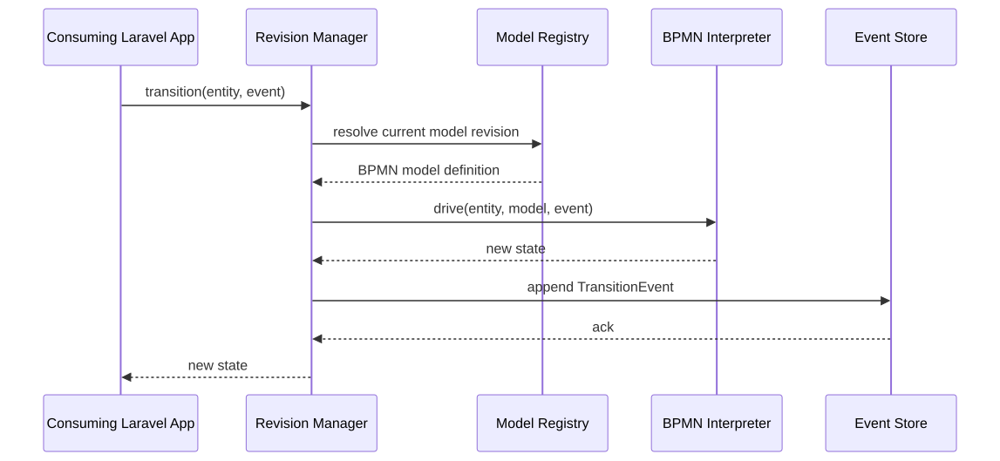
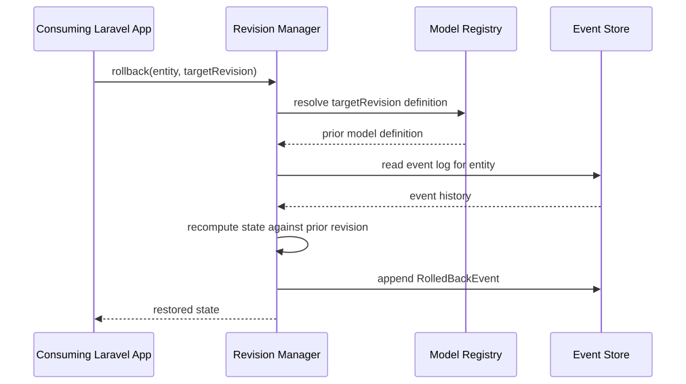
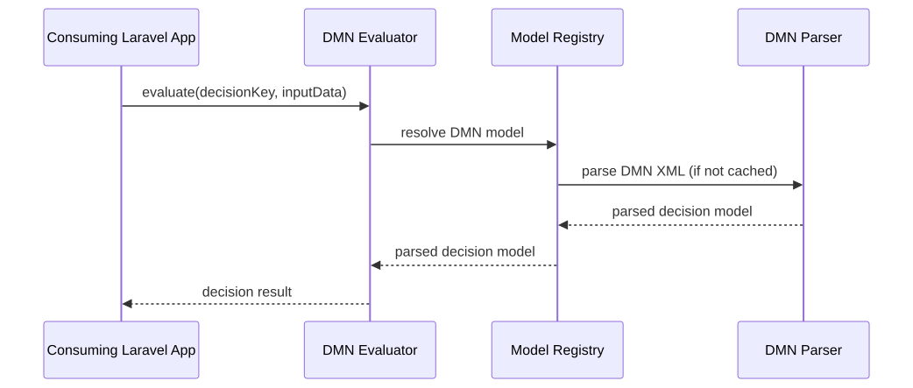
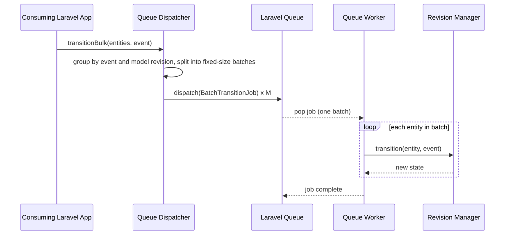

# 6. Runtime View

## Runtime Scenarios
_Key runtime scenarios, each generated from either a BPMN process diagram
or a Mermaid sequence diagram, whichever fits the scenario. These
scenarios describe in-process component call flows within the package
(see [Building Block View](05-building-block-view.md)), so Mermaid
sequence diagrams fit better than BPMN here._

### Drive an entity through a BPMN process

The host app triggers a transition; the Revision Manager resolves the
current model revision and drives it via the BPMN Interpreter, then
persists the resulting event.

### Roll back to a prior model revision

An active entity is rolled back to a previous model revision: the
Revision Manager resolves the target revision, reads the entity's event
history, recomputes state against the prior revision, and appends a
rollback event.

### Evaluate a DMN decision table

The host app requests a decision evaluation; the DMN Evaluator resolves
the parsed decision model via the Model Registry (parsing it via the DMN
Parser if not already cached) and evaluates it against the supplied input
data.

### Bulk transition via queue

The Queue Dispatcher groups the requested transitions by triggering event
and model revision, then splits each group into fixed-size batches (e.g.
1,000 entities), dispatching one Laravel queue job per batch rather than
one job per entity. Each worker loops over its batch, invoking the
Revision Manager's existing single-entity `transition()` call once per
entity — there is no separate batch API on the Revision Manager, and the
Event Store still persists one event per transition (per
[ADR-003](../decisions/adr-003-event-sourcing.md)). Batching reduces
queue dispatch/scheduling overhead, not database write volume, and is
what enables horizontal scale-out toward the 10,000 transitions/sec goal.

**Sources of truth:** `processes/*.bpmn` (BPMN), `architecture/*.mmd`
(Mermaid sequence diagrams).
