# 7. Deployment View

## Infrastructure

As a Laravel package rather than a standalone service, this system has
no infrastructure of its own — deployment is entirely inherited from the
host application. The **BPM Engine Package** container runs in two
roles within that host infrastructure:

- **Web / App Servers** — handles synchronous, single-entity transitions.
- **Queue Workers** — runs `php artisan queue:work`, consuming
  bulk-transition jobs dispatched by the Queue Dispatcher.

Both roles share a **PostgreSQL** instance holding the package's tables
(model registry, event store). This view stays generic/environment-
agnostic (no specific containerization or hosting platform prescribed) —
each host application supplies its own concrete infrastructure.

_C4 Deployment diagram — generated from Structurizr DSL deployment
environments (C4 Level 4)._

**Sources of truth:** `architecture/workspace.dsl` (Structurizr, deployment
nodes).
