# 8. Cross-cutting Concepts

## Domain Model

Core entities, per the [Solution Strategy](04-solution-strategy.md)
event-sourcing decision:

- **Model Definition** + **Model Revision** — what the Model Registry
  manages; each definition (BPMN/CMMN/DMN) has multiple revisions over
  time.
- **Instance** — an active process or case entity being driven through a
  specific model revision.
- **Transition Event** — the event-sourced log entries recording each
  state transition for an instance.
- **Decision Log** — a record of each DMN decision evaluation (inputs,
  outputs, and which model revision was used), optionally tied to an
  instance, for auditability.

_Entity-relationship view — generated from Mermaid `erDiagram` or the
authoritative SQL DDL._

## Business Rules / Decision Logic
_Generated from DMN decision tables via bpmn.io tooling._

## Security, Persistence, and other cross-cutting concerns

**Authorization:** BPMN Pools/Lanes and CMMN Case Roles model
organizational accountability (which role/department is responsible for
an activity), not technical access control — neither standard defines
IAM semantics. Per
[ADR-005](../decisions/adr-005-role-context-not-enforced.md), the engine
exposes this role/lane context via a `TransitionRoleContext` event
dispatched immediately after each transition is durably recorded, but
never enforces access control itself; real authorization is entirely the
host application's responsibility, exercised before calling
`RevisionManager::transition()`/`rollback()`.

Persistence and other concerns are not yet defined — no implementation
exists yet beyond the above. Revisit once the Core module (Model
Registry, Revision Manager, Event Store) is actually being built.

_Free text, hand-authored, linking out to the relevant source-of-truth
diagrams above._

**Sources of truth:** `data-model/*.mmd` or `data-model/schema.sql`,
`decisions/*.dmn`.
